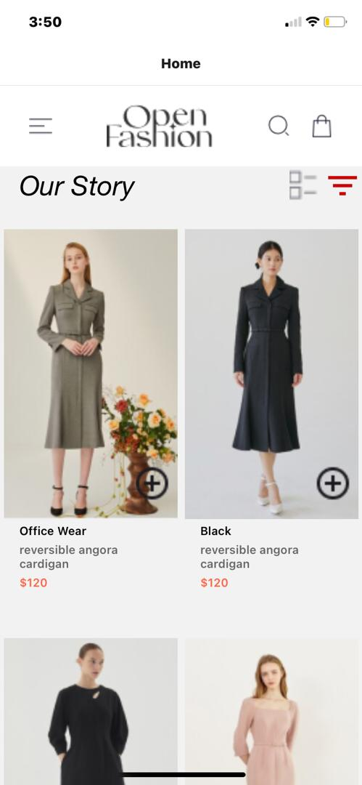
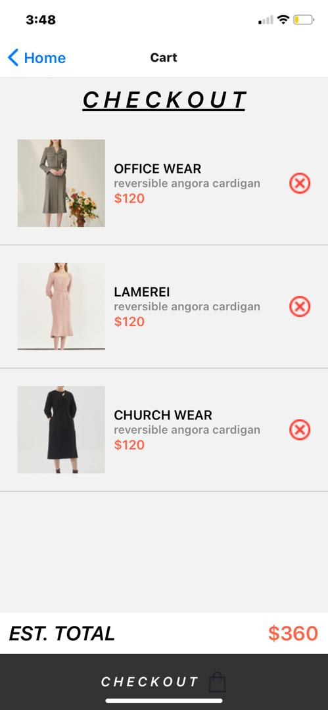

# rn-assignment6-11253585

#### Design Choices:

1. **Navigation**: Implemented navigation using React Navigation (`StackNavigator`) to manage navigation between `HomeScreen` and `CartScreen`.
   
2. **Styling**: Used a clean and minimalist design approach with emphasis on usability and visual appeal. Utilized icons from assets and styled components for a consistent look.

3. **Async Storage**: Employed AsyncStorage from `@react-native-async-storage/async-storage` to persist the user's cart items locally on the device. This ensures that the cart items remain even if the app is closed or restarted.

4. **UI Components**: Used `FlatList` for rendering products and cart items efficiently, ensuring smooth scrolling and optimal performance.

#### Implementation Details:

- **HomeScreen**:
  - Displays a list of products fetched from a local array (`products`).
  - Allows users to add items to the cart with a button press (`addToCart` function).
  - Implemented header with navigation icons (menu, search, and cart).

- **CartScreen**:
  - Retrieves and displays items stored in AsyncStorage upon screen focus (`useFocusEffect`).
  - Allows users to remove items from the cart with a button press (`removeFromCart` function).
  - Shows a total amount dynamically calculated from the items in the cart.

#### Screenshots:

- **HomeScreen**: 
- **CartScreen**: 

#### Future Enhancements:

- **Localization**: Implement multi-language support for broader user accessibility.
- **User Authentication**: Add authentication flow to personalize user experiences and manage user data securely.

